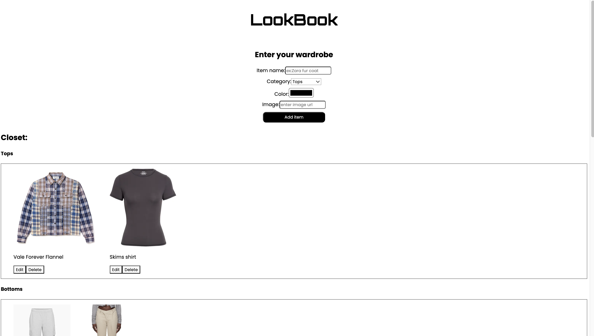

# LookBook

LookBook is a web application that allows users to save and visualize their wardrobe items in a database, and get outfit recommendations.



## Technologies

- React
- TypeScript
- Express
- MongoDB

## Installation

1. Clone the repository:

   ```bash
   git clone
   ```

2. Install dependencies:

   ```bash
   npm install
   ```

3. Start the backend server:

   ```bash
   cd backend
   node server.js
   ```

4. Start the frontend server:
   new terminal
   ```bash
   cd ..
   npm start
   ```
