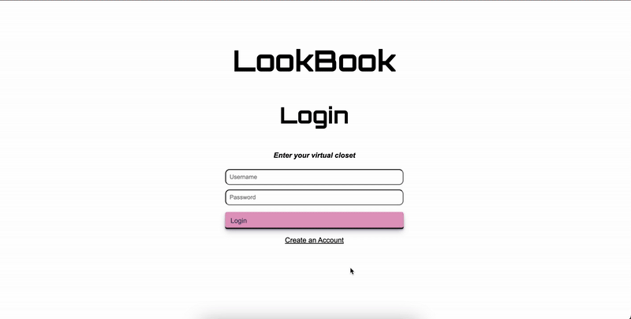
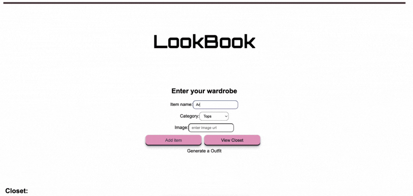
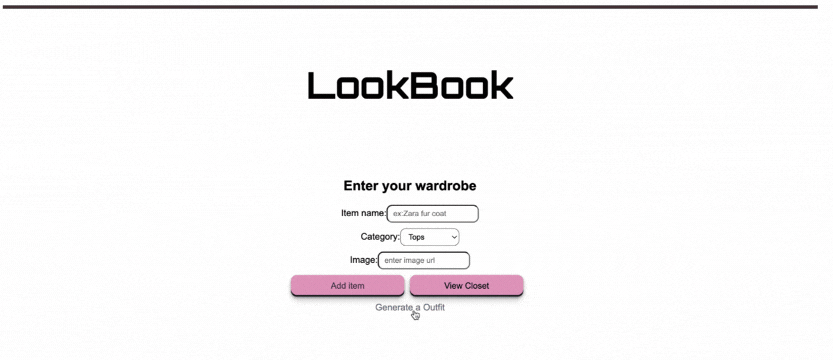

# LookBook

LookBook is a web application designed to help users visualize their wardrobe and get creative with outfit ideas!👗👚👖

It allows users to add, update, and delete wardrobe items while providing outfit recommendations based on their items available in their closet.

## New Features - 2026 Updates

- User Accounts: Allow users to create accounts and save their wardrobe items and outfit preferences 
- Saving outfit recommendations feature
- UI/Styling Improvements!
### Login or Create an Account 



### Add Items, update and delete if necessary 👚



### Outfit Recommendations



## Technologies

- Frontend: React, TypeScript, CSS
- Backend: Express
- Database: MongoDB
- Tools: Webpack

## Installation

1. Fork/Clone the repository:

   ```bash
   git clone
   ```

2. Install dependencies:

   ```bash
   npm install
   ```

3. Start the backend server:

   ```bash
   cd backend
   node server.js
   ```

4. Start the frontend server:
   new terminal
   ```bash
   cd ..
   npm start
   ```


## License

This project is licensed under the terms of the MIT license.
